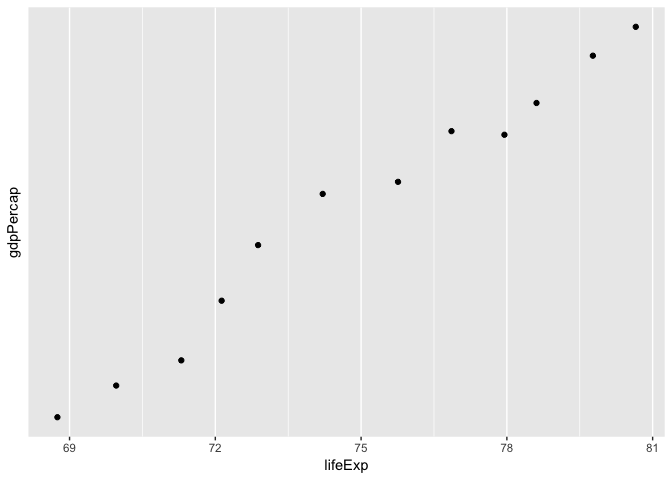

```
## 
## Attaching package: 'dplyr'
```

```
## The following objects are masked from 'package:stats':
## 
##     filter, lag
```

```
## The following objects are masked from 'package:base':
## 
##     intersect, setdiff, setequal, union
```

```
## ── Attaching packages ─────────────────────────────────────────────────────────────────── tidyverse 1.2.1 ──
```

```
## ✔ ggplot2 2.2.1     ✔ readr   1.1.1
## ✔ tibble  2.1.3     ✔ purrr   0.2.5
## ✔ tidyr   0.8.2     ✔ stringr 1.3.1
## ✔ ggplot2 2.2.1     ✔ forcats 0.3.0
```

```
## ── Conflicts ────────────────────────────────────────────────────────────────────── tidyverse_conflicts() ──
## ✖ dplyr::filter() masks stats::filter()
## ✖ dplyr::lag()    masks stats::lag()
```

# Exercise 1

## 1.1


```r
gapminder_modified <- filter(gapminder, year < 1980 & year > 1970 &
       country == "Brazil" |
         country == "Israel" |
         country == "Portugal")
```


<!-- Use filter() to subset the gapminder data to three countries of your choice in the 1970???s. -->


```r
#knitr::kable(
#(eves_data <- gapminder %>%
  #filter((country == "South Africa" | country == "Canada" | country == "United Kingdom") & 
           #(year >= 1970 & year <= 1979)))
#)
```


## 1.2


```r
gapminder_modified %>% 
  select(country, gdpPercap)
```

```
## # A tibble: 26 x 2
##    country gdpPercap
##    <fct>       <dbl>
##  1 Brazil      4986.
##  2 Brazil      6660.
##  3 Israel      4087.
##  4 Israel      5385.
##  5 Israel      7106.
##  6 Israel      8394.
##  7 Israel     12787.
##  8 Israel     13307.
##  9 Israel     15367.
## 10 Israel     17122.
## # … with 16 more rows
```


<!-- Use the pipe operator %>% to select ???country??? and ???gdpPercap??? from your filtered dataset in 1.1. -->


```r
#knitr::kable(
#eves_data %>% 
  #select(country, gdpPercap))
```

## 1.3


```r
gapminder %>% 
  mutate(lifeExpInc = lifeExp - lag(lifeExp)) %>% 
  filter(lifeExpInc > 0)
```

```
## # A tibble: 1,481 x 7
##    country     continent  year lifeExp      pop gdpPercap lifeExpInc
##    <fct>       <fct>     <int>   <dbl>    <int>     <dbl>      <dbl>
##  1 Afghanistan Asia       1957    30.3  9240934      821.     1.53  
##  2 Afghanistan Asia       1962    32.0 10267083      853.     1.66  
##  3 Afghanistan Asia       1967    34.0 11537966      836.     2.02  
##  4 Afghanistan Asia       1972    36.1 13079460      740.     2.07  
##  5 Afghanistan Asia       1977    38.4 14880372      786.     2.35  
##  6 Afghanistan Asia       1982    39.9 12881816      978.     1.42  
##  7 Afghanistan Asia       1987    40.8 13867957      852.     0.968 
##  8 Afghanistan Asia       1992    41.7 16317921      649.     0.852 
##  9 Afghanistan Asia       1997    41.8 22227415      635.     0.0890
## 10 Afghanistan Asia       2002    42.1 25268405      727.     0.366 
## # … with 1,471 more rows
```


<!-- Filter gapminder to all entries that have experienced a drop in life expectancy.  -->
<!-- Be sure to include a new variable that???s the increase in life expectancy in your  -->
<!-- tibble. Hint: you might find the lag() or diff() functions useful. -->


```r
#knitr::kable(
#gapminder %>%
  #mutate(change_lifeExp = lifeExp - first(lifeExp)) %>% 
  #filter(change_lifeExp <0)
#)
```

## 1.4


```r
gapminder %>% 
       group_by(country) %>% 
        filter(gdpPercap == max(gdpPercap))
```

```
## # A tibble: 142 x 6
## # Groups:   country [142]
##    country     continent  year lifeExp       pop gdpPercap
##    <fct>       <fct>     <int>   <dbl>     <int>     <dbl>
##  1 Afghanistan Asia       1982    39.9  12881816      978.
##  2 Albania     Europe     2007    76.4   3600523     5937.
##  3 Algeria     Africa     2007    72.3  33333216     6223.
##  4 Angola      Africa     1967    36.0   5247469     5523.
##  5 Argentina   Americas   2007    75.3  40301927    12779.
##  6 Australia   Oceania    2007    81.2  20434176    34435.
##  7 Austria     Europe     2007    79.8   8199783    36126.
##  8 Bahrain     Asia       2007    75.6    708573    29796.
##  9 Bangladesh  Asia       2007    64.1 150448339     1391.
## 10 Belgium     Europe     2007    79.4  10392226    33693.
## # … with 132 more rows
```


<!-- Filter gapminder so that it shows the max GDP per capita experienced by  -->
<!-- each country. Hint: you might find the max() function useful here. -->


```r
#DT::datatable(
#gapminder %>%
  #group_by(country) %>% 
  #filter(gdpPercap == max(gdpPercap)))
```


## 1.5

<!-- Produce a scatterplot of Canada???s life expectancy vs. GDP per capita using ggplot2,  -->
<!-- without defining a new variable. That is, after filtering the gapminder data set,  -->
<!-- pipe it directly into the ggplot() function. Ensure GDP per capita is on a log scale. -->


```r
gapminder %>% 
  filter(country == 'Canada') %>% 
  ggplot(aes(lifeExp, gdpPercap)) +
  geom_point() +
  scale_x_log10()
```

<!-- -->


```r
#gapminder %>% 
  #filter(country =="Canada") %>%
  #ggplot(aes(gdpPercap, lifeExp)) +
    #geom_point() +
    #xlab("GDP per capita") +
    #ylab("Life expectancy") +
    #ggtitle("Life expectancy vs. GDP per capita in Canada")+
    #scale_x_log10()
```


## Exercise 2

Categorical variable: Continet

There are 5 possible values for the variable Continent:


```r
summary(gapminder$continent)
```

```
##   Africa Americas     Asia   Europe  Oceania 
##      624      300      396      360       24
```

The following graphic shows the amount of data per continent:


```r
ggplot(gapminder, aes(continent)) +
  geom_bar()+
  ylab("Count")+
  xlab("Continent")
```

<!-- -->

Quantitative variable: Population


```r
range(gapminder$pop)
```

```
## [1]      60011 1318683096
```

The following graphic shows the ammount of population in each continent:


```r
ggplot(gapminder, aes(continent, pop)) +
  geom_col()
```

<!-- -->


Then we can also look at the distribution for life expectancy over the continents:

```r
ggplot(gapminder, aes(continent, gdpPercap)) +
  #geom_point() +
  geom_boxplot()
```

<!-- -->


## Question 3


## Recycling

For people who want to take things further.

Evaluate this code and describe the result. Presumably the analyst???s intent was to get the data for Rwanda and Afghanistan. Did they succeed? Why or why not? If not, what is the correct way to do this?


```r
DT::datatable(filter(gapminder, country == c("Rwanda", "Afghanistan")))
```

<!--html_preserve--><div id="htmlwidget-db340aa79ac40d03778c" style="width:100%;height:auto;" class="datatables html-widget"></div>
<script type="application/json" data-for="htmlwidget-db340aa79ac40d03778c">{"x":{"filter":"none","data":[["1","2","3","4","5","6","7","8","9","10","11","12"],["Afghanistan","Afghanistan","Afghanistan","Afghanistan","Afghanistan","Afghanistan","Rwanda","Rwanda","Rwanda","Rwanda","Rwanda","Rwanda"],["Asia","Asia","Asia","Asia","Asia","Asia","Africa","Africa","Africa","Africa","Africa","Africa"],[1957,1967,1977,1987,1997,2007,1952,1962,1972,1982,1992,2002],[30.332,34.02,38.438,40.822,41.763,43.828,40,43,44.6,46.218,23.599,43.413],[9240934,11537966,14880372,13867957,22227415,31889923,2534927,3051242,3992121,5507565,7290203,7852401],[820.8530296,836.1971382,786.11336,852.3959448,635.341351,974.5803384,493.3238752,597.4730727,590.5806638,881.5706467,737.0685949,785.6537648]],"container":"<table class=\"display\">\n  <thead>\n    <tr>\n      <th> <\/th>\n      <th>country<\/th>\n      <th>continent<\/th>\n      <th>year<\/th>\n      <th>lifeExp<\/th>\n      <th>pop<\/th>\n      <th>gdpPercap<\/th>\n    <\/tr>\n  <\/thead>\n<\/table>","options":{"columnDefs":[{"className":"dt-right","targets":[3,4,5,6]},{"orderable":false,"targets":0}],"order":[],"autoWidth":false,"orderClasses":false}},"evals":[],"jsHooks":[]}</script><!--/html_preserve-->

This code does work and produces a table with the data for Rwanda and Afghanistan.Presumably this is because `country == c("Rwanda", "Afghanistan")` evaluated the same as `(country == "Rwanda" | country=="Afghanistan")`, thus data for both countries is returned. 
