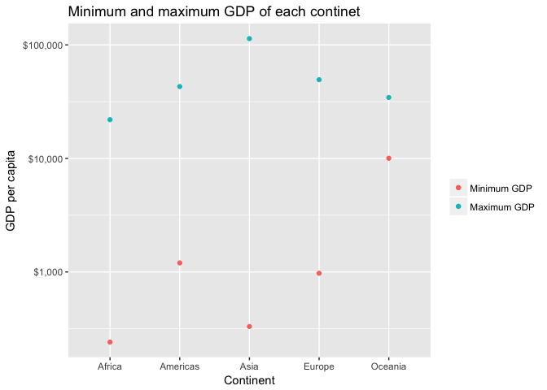
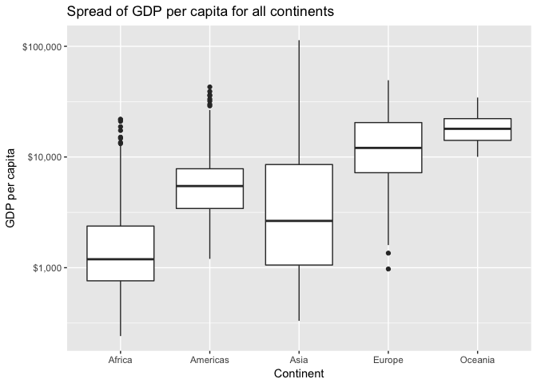
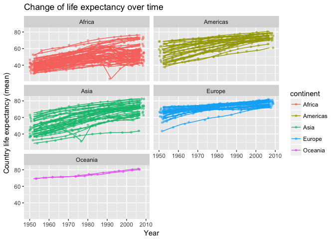

In this assignment we will explore the gapminder dataset using the dplyr package. Before we start we need to load a couple of packages. 


```r
library(tidyverse)
library(gapminder)
library(dplyr)
library(DT)
library(knitr)
```

I have decided to work on tasks 2, 3 and 6.

## Task Option 2
Instructions: Get the maximum and minimum of GDP per capita for all continents.

We first produce a tibble (a type of data frame).


```r
task_2 <- gapminder %>% #We name our modified dataset
  group_by(continent) %>% #We use this function in order to obtain the information at the continent level.
  summarise(min_gdp = min(gdpPercap), #then we use this function in order to obtain the maximum and minimum of GDP per capita. 
            max_gdp = max(gdpPercap))
  
task_2
```

```
## # A tibble: 5 x 3
##   continent min_gdp max_gdp
##   <fct>       <dbl>   <dbl>
## 1 Africa       241.  21951.
## 2 Americas    1202.  42952.
## 3 Asia         331  113523.
## 4 Europe       974.  49357.
## 5 Oceania    10040.  34435.
```

From the tibble we produced above, we now create a plot. 


```r
task_2 %>% 
  ggplot(aes())+ #We can plot the GDP max and min in the same plot by using geom_point twice. We could also use some other type of "geom". 
  geom_point(aes(continent,max_gdp, colour = "red"))+ 
  geom_point(aes(continent,min_gdp, colour = "blue"))+
  labs(title="Minimum and maximum GDP of each continet",
               x="Continent",
               y="GDP per capita")+
  scale_color_discrete("",labels=c("Minimum GDP", "Maximum GDP"))+
  scale_y_log10(labels = scales::dollar_format())
```

<!-- -->


## Task Option 3

Instructions: Look at the spread of GDP per capita within the continents.

We first create a table. 

```r
gapminder %>% 
  group_by(continent) %>% 
  summarize(max_gdpPercap = max(gdpPercap),#We can use a couple of different functions within the summarize function. 
            min_gdpPercap = min(gdpPercap),
            range_gdpPercap = max(gdpPercap)-min(gdpPercap),
            sd_gdpPercap = sd(gdpPercap),
            mean_gdpPercap = mean(gdpPercap),
            median_gdpPercap = median(gdpPercap)) %>% 
  knitr::kable()
```


continent    max_gdpPercap   min_gdpPercap   range_gdpPercap   sd_gdpPercap   mean_gdpPercap   median_gdpPercap
----------  --------------  --------------  ----------------  -------------  ---------------  -----------------
Africa            21951.21        241.1659          21710.05       2827.930         2193.755           1192.138
Americas          42951.65       1201.6372          41750.02       6396.764         7136.110           5465.510
Asia             113523.13        331.0000         113192.13      14045.373         7902.150           2646.787
Europe            49357.19        973.5332          48383.66       9355.213        14469.476          12081.749
Oceania           34435.37      10039.5956          24395.77       6358.983        18621.609          17983.304

Now we create a plot.

```r
gapminder %>% 
  ggplot(aes(continent, gdpPercap)) +
  geom_boxplot() + #We use this type of "geom" as we want to show the spread of GDP.
  scale_y_log10(labels = scales::dollar_format()) + #We can add a dollar sign to the values on the y axis.
  labs(title = "Spread of GDP per capita for all continents", 
       x = "Continent", 
       y = "GDP per capita")
```

<!-- -->


## Task Option 5

Instructions: How is life expectancy changing over time on different continents?

As before, we first create a table that shows the average life expectancy for each continent for each year. 

```r
gapminder %>% 
  group_by(continent, year) %>% 
  summarise(mean_life = mean(lifeExp)) %>% 
  DT::datatable()
```

<!--html_preserve--><div id="htmlwidget-e5e55bddc66de22a55a9" style="width:100%;height:auto;" class="datatables html-widget"></div>
<script type="application/json" data-for="htmlwidget-e5e55bddc66de22a55a9">{"x":{"filter":"none","data":[["1","2","3","4","5","6","7","8","9","10","11","12","13","14","15","16","17","18","19","20","21","22","23","24","25","26","27","28","29","30","31","32","33","34","35","36","37","38","39","40","41","42","43","44","45","46","47","48","49","50","51","52","53","54","55","56","57","58","59","60"],["Africa","Africa","Africa","Africa","Africa","Africa","Africa","Africa","Africa","Africa","Africa","Africa","Americas","Americas","Americas","Americas","Americas","Americas","Americas","Americas","Americas","Americas","Americas","Americas","Asia","Asia","Asia","Asia","Asia","Asia","Asia","Asia","Asia","Asia","Asia","Asia","Europe","Europe","Europe","Europe","Europe","Europe","Europe","Europe","Europe","Europe","Europe","Europe","Oceania","Oceania","Oceania","Oceania","Oceania","Oceania","Oceania","Oceania","Oceania","Oceania","Oceania","Oceania"],[1952,1957,1962,1967,1972,1977,1982,1987,1992,1997,2002,2007,1952,1957,1962,1967,1972,1977,1982,1987,1992,1997,2002,2007,1952,1957,1962,1967,1972,1977,1982,1987,1992,1997,2002,2007,1952,1957,1962,1967,1972,1977,1982,1987,1992,1997,2002,2007,1952,1957,1962,1967,1972,1977,1982,1987,1992,1997,2002,2007],[39.1355,41.2663461538462,43.3194423076923,45.3345384615385,47.4509423076923,49.5804230769231,51.5928653846154,53.3447884615385,53.6295769230769,53.5982692307692,53.3252307692308,54.8060384615385,53.27984,55.96028,58.39876,60.41092,62.39492,64.39156,66.22884,68.09072,69.56836,71.15048,72.42204,73.60812,46.3143939393939,49.3185442424242,51.563223030303,54.66364,57.3192690909091,59.6105563636364,62.6179393939394,64.8511818181818,66.5372121212121,68.0205151515152,69.2338787878788,70.7284848484849,64.4085,66.7030666666667,68.5392333333333,69.7376,70.7750333333333,71.9377666666667,72.8064,73.6421666666667,74.4401,75.5051666666667,76.7006,77.6486,69.255,70.295,71.085,71.31,71.91,72.855,74.29,75.32,76.945,78.19,79.74,80.7195]],"container":"<table class=\"display\">\n  <thead>\n    <tr>\n      <th> <\/th>\n      <th>continent<\/th>\n      <th>year<\/th>\n      <th>mean_life<\/th>\n    <\/tr>\n  <\/thead>\n<\/table>","options":{"columnDefs":[{"className":"dt-right","targets":[2,3]},{"orderable":false,"targets":0}],"order":[],"autoWidth":false,"orderClasses":false}},"evals":[],"jsHooks":[]}</script><!--/html_preserve-->

Now we create a plot: 

```r
gapminder %>% 
  ggplot(aes(year, lifeExp, group = country, colour = continent)) +
  geom_jitter(size = 1, alpha = 0.5)+ #We use geom_jitter to show the behaviour of each country within each continent. 
  geom_line()+
  facet_wrap(~ continent, nrow = 3)  +
  labs(title = "Change of life expectancy over time", 
       x = "Year", 
       y = "Country life expectancy (mean)")
```

<!-- -->
