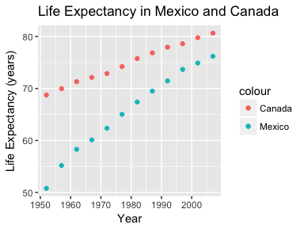

```r
library(tidyverse)
library(gapminder)
library(dplyr)
library(ggplot2)
library(knitr)
library(DT)
library(devtools)
```

#Exercise 1 - Univariate option 1: 


```r
dat = gapminder %>%
  filter(country == "Mexico" | country == "Canada") %>%
  select(country, year, lifeExp) %>%
  pivot_wider(id_cols = year,
              names_from = country,
              names_prefix = "lifeExp_",
              values_from = lifeExp)

DT::datatable(dat)
```

<!--html_preserve--><div id="htmlwidget-055238f10cae0e42b34e" style="width:100%;height:auto;" class="datatables html-widget"></div>
<script type="application/json" data-for="htmlwidget-055238f10cae0e42b34e">{"x":{"filter":"none","data":[["1","2","3","4","5","6","7","8","9","10","11","12"],[1952,1957,1962,1967,1972,1977,1982,1987,1992,1997,2002,2007],[68.75,69.96,71.3,72.13,72.88,74.21,75.76,76.86,77.95,78.61,79.77,80.653],[50.789,55.19,58.299,60.11,62.361,65.032,67.405,69.498,71.455,73.67,74.902,76.195]],"container":"<table class=\"display\">\n  <thead>\n    <tr>\n      <th> <\/th>\n      <th>year<\/th>\n      <th>lifeExp_Canada<\/th>\n      <th>lifeExp_Mexico<\/th>\n    <\/tr>\n  <\/thead>\n<\/table>","options":{"columnDefs":[{"className":"dt-right","targets":[1,2,3]},{"orderable":false,"targets":0}],"order":[],"autoWidth":false,"orderClasses":false}},"evals":[],"jsHooks":[]}</script><!--/html_preserve-->


```r
axis_lim = c(min(dat$lifeExp_Mexico, dat$lifeExp_Canada),
             max(dat$lifeExp_Mexico , dat$lifeExp_Canada))
dat %>%
  ggplot(aes(lifeExp_Mexico, lifeExp_Canada)) +
  geom_point(aes(colour = "red"), size = 3) +
  geom_abline(linetype = 2, alpha = 0.3) +
  geom_text(aes(label = year), size = 3, hjust = 1.3) +
  coord_fixed(xlim = axis_lim, ylim = axis_lim) +
  labs(title = "Life Expectancy (years) of Canada against Mexico",
       x = "Life Expectancy in Mexico",
       y = "Life Expectancy in Canada") +
  theme_bw() +
  theme(legend.position = "none")
```

<!-- -->

```r
dat %>%
  pivot_longer(cols = c(lifeExp_Mexico, lifeExp_Canada),
               names_to = "country",
               names_prefix = "lifeExp_",
               values_to = "lifeExp") %>%
  DT::datatable()
```

<!--html_preserve--><div id="htmlwidget-33fde0b5725977b33fd1" style="width:100%;height:auto;" class="datatables html-widget"></div>
<script type="application/json" data-for="htmlwidget-33fde0b5725977b33fd1">{"x":{"filter":"none","data":[["1","2","3","4","5","6","7","8","9","10","11","12","13","14","15","16","17","18","19","20","21","22","23","24"],[1952,1952,1957,1957,1962,1962,1967,1967,1972,1972,1977,1977,1982,1982,1987,1987,1992,1992,1997,1997,2002,2002,2007,2007],["Mexico","Canada","Mexico","Canada","Mexico","Canada","Mexico","Canada","Mexico","Canada","Mexico","Canada","Mexico","Canada","Mexico","Canada","Mexico","Canada","Mexico","Canada","Mexico","Canada","Mexico","Canada"],[50.789,68.75,55.19,69.96,58.299,71.3,60.11,72.13,62.361,72.88,65.032,74.21,67.405,75.76,69.498,76.86,71.455,77.95,73.67,78.61,74.902,79.77,76.195,80.653]],"container":"<table class=\"display\">\n  <thead>\n    <tr>\n      <th> <\/th>\n      <th>year<\/th>\n      <th>country<\/th>\n      <th>lifeExp<\/th>\n    <\/tr>\n  <\/thead>\n<\/table>","options":{"columnDefs":[{"className":"dt-right","targets":[1,3]},{"orderable":false,"targets":0}],"order":[],"autoWidth":false,"orderClasses":false}},"evals":[],"jsHooks":[]}</script><!--/html_preserve-->

#Exercise 2 / Multivariate Option 1: 
##Make a tibble with one row per year, and columns for life expectancy and GDP per capita (or two other numeric variables) for two or more countries.


```r
dat = gapminder %>%
  filter(country == "Mexico" | country == "Canada") %>%
  select(country, year, gdpPercap, lifeExp) %>%
  pivot_wider(id_cols = year,
              names_from = country,
              names_sep = "_",
              values_from = c("lifeExp", "gdpPercap"))
DT::datatable(dat)
```

<!--html_preserve--><div id="htmlwidget-296db1fc0f36893631cd" style="width:100%;height:auto;" class="datatables html-widget"></div>
<script type="application/json" data-for="htmlwidget-296db1fc0f36893631cd">{"x":{"filter":"none","data":[["1","2","3","4","5","6","7","8","9","10","11","12"],[1952,1957,1962,1967,1972,1977,1982,1987,1992,1997,2002,2007],[68.75,69.96,71.3,72.13,72.88,74.21,75.76,76.86,77.95,78.61,79.77,80.653],[50.789,55.19,58.299,60.11,62.361,65.032,67.405,69.498,71.455,73.67,74.902,76.195],[11367.16112,12489.95006,13462.48555,16076.58803,18970.57086,22090.88306,22898.79214,26626.51503,26342.88426,28954.92589,33328.96507,36319.23501],[3478.125529,4131.546641,4581.609385,5754.733883,6809.40669,7674.929108,9611.147541,8688.156003,9472.384295,9767.29753,10742.44053,11977.57496]],"container":"<table class=\"display\">\n  <thead>\n    <tr>\n      <th> <\/th>\n      <th>year<\/th>\n      <th>lifeExp_Canada<\/th>\n      <th>lifeExp_Mexico<\/th>\n      <th>gdpPercap_Canada<\/th>\n      <th>gdpPercap_Mexico<\/th>\n    <\/tr>\n  <\/thead>\n<\/table>","options":{"columnDefs":[{"className":"dt-right","targets":[1,2,3,4,5]},{"orderable":false,"targets":0}],"order":[],"autoWidth":false,"orderClasses":false}},"evals":[],"jsHooks":[]}</script><!--/html_preserve-->

##Re-lengthen the data.


```r
dat %>%
  pivot_longer(cols = -year,
               names_to = c(".value" ,"country"),
               names_sep = "_",
               values_to = c("lifeExp", "gdpPercap")) %>%
  DT::datatable()
```

<!--html_preserve--><div id="htmlwidget-590ea5caca217d1f14a1" style="width:100%;height:auto;" class="datatables html-widget"></div>
<script type="application/json" data-for="htmlwidget-590ea5caca217d1f14a1">{"x":{"filter":"none","data":[["1","2","3","4","5","6","7","8","9","10","11","12","13","14","15","16","17","18","19","20","21","22","23","24"],[1952,1952,1957,1957,1962,1962,1967,1967,1972,1972,1977,1977,1982,1982,1987,1987,1992,1992,1997,1997,2002,2002,2007,2007],["Canada","Mexico","Canada","Mexico","Canada","Mexico","Canada","Mexico","Canada","Mexico","Canada","Mexico","Canada","Mexico","Canada","Mexico","Canada","Mexico","Canada","Mexico","Canada","Mexico","Canada","Mexico"],[68.75,50.789,69.96,55.19,71.3,58.299,72.13,60.11,72.88,62.361,74.21,65.032,75.76,67.405,76.86,69.498,77.95,71.455,78.61,73.67,79.77,74.902,80.653,76.195],[11367.16112,3478.125529,12489.95006,4131.546641,13462.48555,4581.609385,16076.58803,5754.733883,18970.57086,6809.40669,22090.88306,7674.929108,22898.79214,9611.147541,26626.51503,8688.156003,26342.88426,9472.384295,28954.92589,9767.29753,33328.96507,10742.44053,36319.23501,11977.57496]],"container":"<table class=\"display\">\n  <thead>\n    <tr>\n      <th> <\/th>\n      <th>year<\/th>\n      <th>country<\/th>\n      <th>lifeExp<\/th>\n      <th>gdpPercap<\/th>\n    <\/tr>\n  <\/thead>\n<\/table>","options":{"columnDefs":[{"className":"dt-right","targets":[1,3,4]},{"orderable":false,"targets":0}],"order":[],"autoWidth":false,"orderClasses":false}},"evals":[],"jsHooks":[]}</script><!--/html_preserve-->

#Exercise 3: Table Joins


##3.1


```r
colnames(email) <- c("name", "email")
email_modified <- email %>% 
  separate_rows(name, sep = ", " )

email_modified %>% 
  left_join(guest, by = "name")
```

```
## # A tibble: 28 x 8
##    name  email party meal_wedding meal_brunch attendance_wedd…
##    <chr> <chr> <int> <chr>        <chr>       <chr>           
##  1 Somm… somm…     1 PENDING      PENDING     PENDING         
##  2 Phil… somm…     1 vegetarian   Menu C      CONFIRMED       
##  3 Blan… somm…     1 chicken      Menu A      CONFIRMED       
##  4 Emaa… somm…     1 PENDING      PENDING     PENDING         
##  5 Blai… bpar…     2 chicken      Menu C      CONFIRMED       
##  6 Nige… bpar…     2 <NA>         <NA>        CANCELLED       
##  7 Sine… sing…     3 PENDING      PENDING     PENDING         
##  8 Ayra… mark…     4 vegetarian   Menu B      PENDING         
##  9 Jole… jw19…     6 <NA>         <NA>        CANCELLED       
## 10 Hayl… jw19…     6 vegetarian   Menu C      CONFIRMED       
## # … with 18 more rows, and 2 more variables: attendance_brunch <chr>,
## #   attendance_golf <chr>
```

```r
DT::datatable(email_modified)
```

<!--html_preserve--><div id="htmlwidget-996134ab8781b6bac8d0" style="width:100%;height:auto;" class="datatables html-widget"></div>
<script type="application/json" data-for="htmlwidget-996134ab8781b6bac8d0">{"x":{"filter":"none","data":[["1","2","3","4","5","6","7","8","9","10","11","12","13","14","15","16","17","18","19","20","21","22","23","24","25","26","27","28"],["Sommer Medrano","Phillip Medrano","Blanka Medrano","Emaan Medrano","Blair Park","Nigel Webb","Sinead English","Ayra Marks","Jolene Welsh","Hayley Booker","Amayah Sanford","Erika Foley","Ciaron Acosta","Diana Stuart","Daisy-May Caldwell","Martin Caldwell","Violet Caldwell","Nazifa Caldwell","Eric Caldwell","Rosanna Bird","Kurtis Frost","Huma Stokes","Samuel Rutledge","Eddison Collier","Stewart Nicholls","Turner Jones","Albert Marshall","Vivian Marshall"],["sommm@gmail.com","sommm@gmail.com","sommm@gmail.com","sommm@gmail.com","bpark@gmail.com","bpark@gmail.com","singlish@hotmail.ca","marksa42@gmail.com","jw1987@hotmail.com","jw1987@hotmail.com","erikaaaaaa@gmail.com","erikaaaaaa@gmail.com","shining_ciaron@gmail.com","doodledianastu@gmail.com","caldwellfamily5212@gmail.com","caldwellfamily5212@gmail.com","caldwellfamily5212@gmail.com","caldwellfamily5212@gmail.com","caldwellfamily5212@gmail.com","rosy1987b@gmail.com","rosy1987b@gmail.com","humastokes@gmail.com","humastokes@gmail.com","eddison.collier@gmail.com","eddison.collier@gmail.com","tjjones12@hotmail.ca","themarshallfamily1234@gmail.com","themarshallfamily1234@gmail.com"]],"container":"<table class=\"display\">\n  <thead>\n    <tr>\n      <th> <\/th>\n      <th>name<\/th>\n      <th>email<\/th>\n    <\/tr>\n  <\/thead>\n<\/table>","options":{"order":[],"autoWidth":false,"orderClasses":false,"columnDefs":[{"orderable":false,"targets":0}]}},"evals":[],"jsHooks":[]}</script><!--/html_preserve-->

##3.2


```r
non_guest <- email_modified %>%
  anti_join(guest, by = "name")


  knitr::kable(non_guest)
```


name              email                           
----------------  --------------------------------
Turner Jones      tjjones12@hotmail.ca            
Albert Marshall   themarshallfamily1234@gmail.com 
Vivian Marshall   themarshallfamily1234@gmail.com 

##3.3: Make a guestlist that includes everyone we have emails for (in addition to those on the original guestlist).


```r
bind_rows(email_modified, non_guest) %>% 
  DT::datatable()
```

<!--html_preserve--><div id="htmlwidget-ac1cbcfc6570032ec353" style="width:100%;height:auto;" class="datatables html-widget"></div>
<script type="application/json" data-for="htmlwidget-ac1cbcfc6570032ec353">{"x":{"filter":"none","data":[["1","2","3","4","5","6","7","8","9","10","11","12","13","14","15","16","17","18","19","20","21","22","23","24","25","26","27","28","29","30","31"],["Sommer Medrano","Phillip Medrano","Blanka Medrano","Emaan Medrano","Blair Park","Nigel Webb","Sinead English","Ayra Marks","Jolene Welsh","Hayley Booker","Amayah Sanford","Erika Foley","Ciaron Acosta","Diana Stuart","Daisy-May Caldwell","Martin Caldwell","Violet Caldwell","Nazifa Caldwell","Eric Caldwell","Rosanna Bird","Kurtis Frost","Huma Stokes","Samuel Rutledge","Eddison Collier","Stewart Nicholls","Turner Jones","Albert Marshall","Vivian Marshall","Turner Jones","Albert Marshall","Vivian Marshall"],["sommm@gmail.com","sommm@gmail.com","sommm@gmail.com","sommm@gmail.com","bpark@gmail.com","bpark@gmail.com","singlish@hotmail.ca","marksa42@gmail.com","jw1987@hotmail.com","jw1987@hotmail.com","erikaaaaaa@gmail.com","erikaaaaaa@gmail.com","shining_ciaron@gmail.com","doodledianastu@gmail.com","caldwellfamily5212@gmail.com","caldwellfamily5212@gmail.com","caldwellfamily5212@gmail.com","caldwellfamily5212@gmail.com","caldwellfamily5212@gmail.com","rosy1987b@gmail.com","rosy1987b@gmail.com","humastokes@gmail.com","humastokes@gmail.com","eddison.collier@gmail.com","eddison.collier@gmail.com","tjjones12@hotmail.ca","themarshallfamily1234@gmail.com","themarshallfamily1234@gmail.com","tjjones12@hotmail.ca","themarshallfamily1234@gmail.com","themarshallfamily1234@gmail.com"]],"container":"<table class=\"display\">\n  <thead>\n    <tr>\n      <th> <\/th>\n      <th>name<\/th>\n      <th>email<\/th>\n    <\/tr>\n  <\/thead>\n<\/table>","options":{"order":[],"autoWidth":false,"orderClasses":false,"columnDefs":[{"orderable":false,"targets":0}]}},"evals":[],"jsHooks":[]}</script><!--/html_preserve-->


